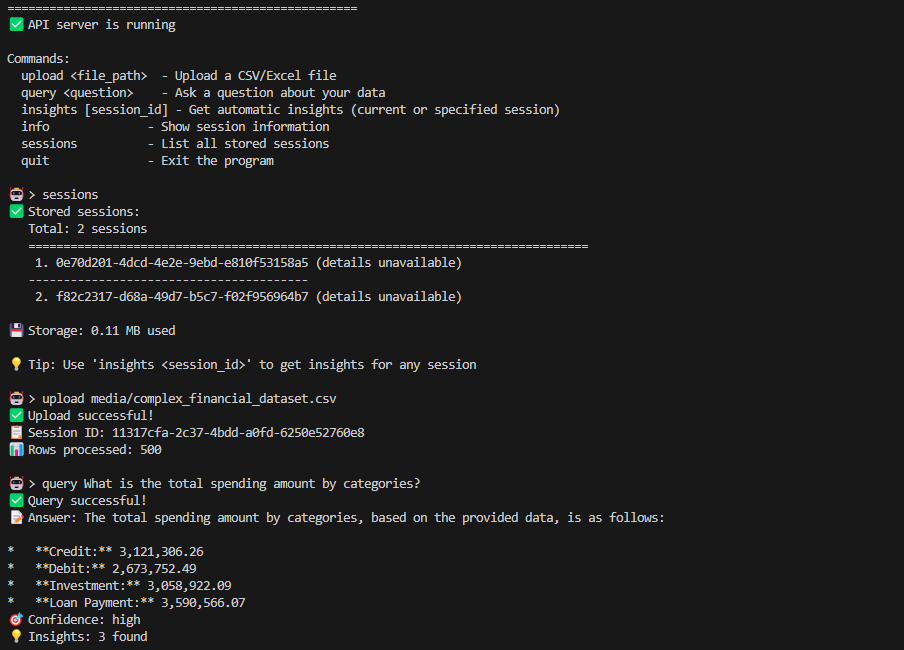
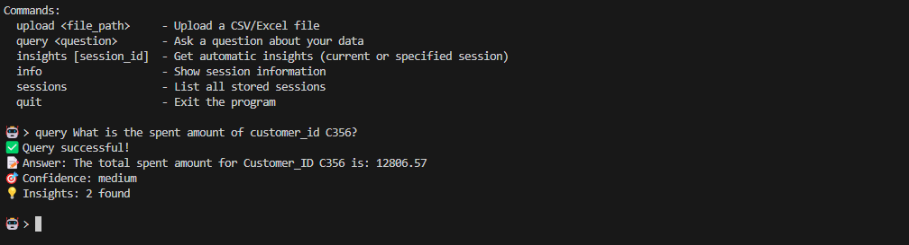
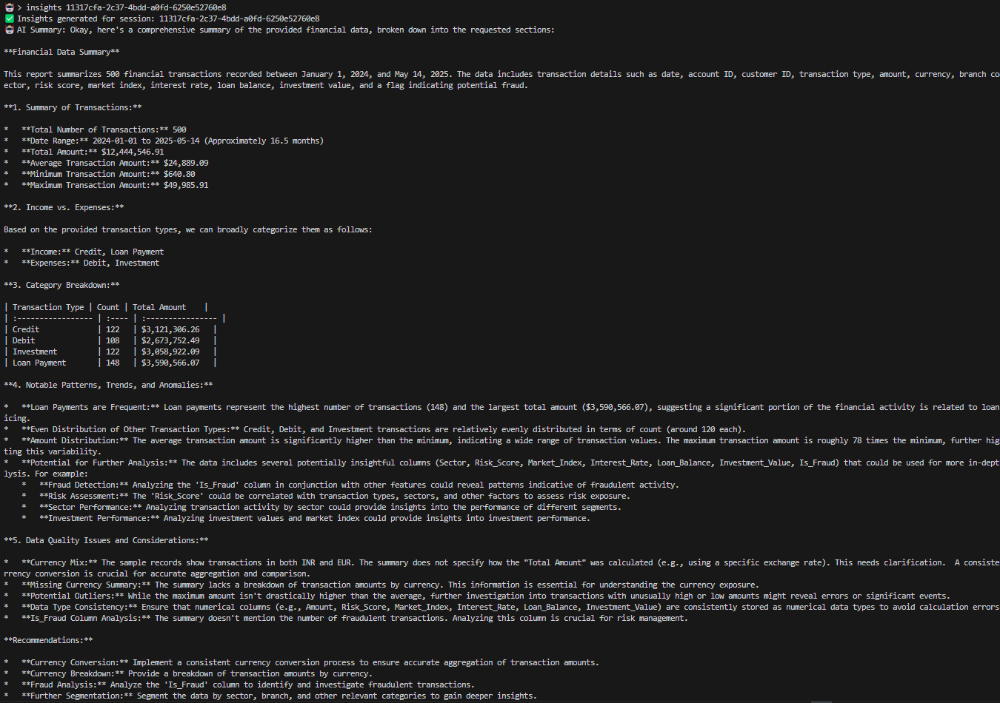
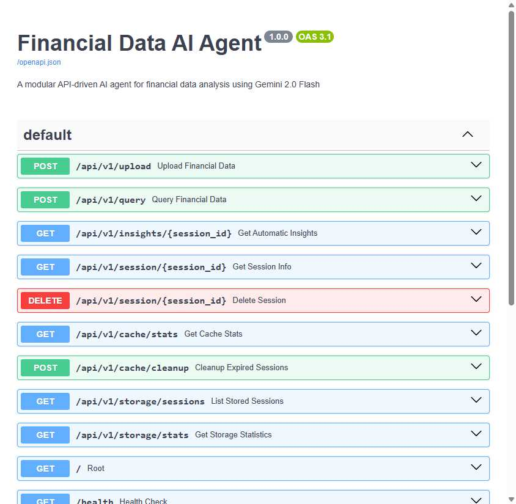

# 🤖 Financial Data AI Agent

A powerful, modular API-driven AI agent that processes financial data and provides intelligent insights using Google's Gemini 2.0 Flash model. Built with pure Python without heavy frameworks like LangChain or CrewAI.


## 🌟 Key Features

### 🎯 **Intelligent Query Routing**
- **Automatic Decision Making**: Seamlessly switches between AI analysis and code execution based on query type
- **Pattern Recognition**: Detects transaction IDs, customer IDs, and specific data requests
- **Smart Context Analysis**: Understands when full dataset access is needed vs. summary analysis

### 💻 **Dynamic Code Generation**
- **Gemini-Powered**: Uses Gemini 2.0 Flash to generate pandas code for specific queries
- **Full Dataset Access**: Code execution queries access complete data, not just summaries
- **Safe Execution**: Secure code execution environment with proper error handling

### 📊 **Comprehensive Data Processing**
- **Multi-Format Support**: Upload CSV/Excel files with automatic format detection
- **Intelligent Column Detection**: Automatically identifies date, amount, and category columns
- **Data Validation**: Comprehensive validation and cleaning pipeline

### 🔄 **Session Management**
- **Persistent Storage**: All session data stored in organized file structure (`data/<session_id>/`)
- **Memory Caching**: Fast in-memory access with automatic cleanup
- **Session Tracking**: Complete audit trail of data uploads and queries

### 🚀 **Production-Ready API**
- **FastAPI Backend**: High-performance async API with automatic documentation
- **RESTful Design**: Clean API endpoints with proper HTTP methods
- **CORS Support**: Ready for web frontend integration

### 💻 **Interactive CLI**
- **Command-Line Interface**: Full-featured CLI for all operations
- **Interactive Mode**: Real-time query processing and session management
- **Batch Operations**: Support for bulk data processing

## 🏗️ Architecture

### System Architecture


### Data Flow Diagram


### Sequence Diagram


### 🧩 **Component Overview**

#### **Client Layer**
- **Web Browser**: File upload and query interface
- **CLI App** (`app.py`): Interactive command-line interface
- **API Clients**: REST API integration for external systems
- **Test Suite**: Comprehensive testing framework

#### **API Gateway Layer**
- **FastAPI Application** (`main.py`): Core API server with CORS and middleware
- **Endpoints** (`src/api/endpoints.py`): RESTful API routes and request handling

#### **Core Business Layer**
- **Configuration** (`src/core/config.py`): Environment and application settings
- **Gemini Client** (`src/core/gemini_client.py`): AI model integration and optimization

#### **Services Layer**
- **Query Engine** (`src/services/query_engine.py`): Intelligent query routing and processing
- **Data Processor** (`src/services/data_processor.py`): Data cleaning and transformation
- **Code Executor** (`src/services/code_executor.py`): Safe pandas code generation and execution
- **Prompt Templates** (`src/services/prompt_templates.py`): AI prompt optimization

#### **Utilities Layer**
- **Session Cache** (`src/utils/cache.py`): In-memory data management
- **Data Storage** (`src/utils/storage.py`): Persistent file-based storage
- **Validators** (`src/utils/validators.py`): Input validation and sanitization

#### **Data Layer**
- **Session Storage**: Organized file structure with CSV, pickle, and metadata
- **Memory Cache**: Fast access to active sessions and query results

## 🚀 Quick Start

### 1. **Installation**

```bash
# Clone the repository
git https://github.com/Abhi-vish/FinancialDataAnalyst_Agent.git
cd FinancialDataAnalyst_Agent

# Create virtual environment
python -m venv .venv
source .venv/bin/activate  # On Windows: .venv\Scripts\activate

# Install dependencies
pip install -r requirements.txt
```

### 2. **Configuration**

Create a `.env` file in the project root:

```env
# Required: Google Gemini API Key
GEMINI_API_KEY=your_gemini_api_key_here

# Optional: Server Configuration
HOST=0.0.0.0
PORT=8000
DEBUG=True

# Optional: Data Storage
DATA_DIR=data
MAX_FILE_SIZE_MB=100
```

### 3. **Start the Server**

```bash
# Option 1: Direct start
python main.py

# Option 2: Using startup script
python start.py

# Option 3: Using uvicorn directly
uvicorn main:app --reload --host 0.0.0.0 --port 8000
```

### 4. **Verify Installation**

```bash
# Check server health
curl http://localhost:8000/health

# Or visit the API documentation
# http://localhost:8000/docs
```

## 💻 Usage

### **Web Interface**
Visit `http://localhost:8000/docs` for the interactive API documentation and testing interface.

### **Command Line Interface**

#### **Interactive Mode**
```bash
python app.py --interactive
```

#### **Direct Commands**
```bash
# Upload a file
python app.py --upload path/to/your/financial_data.csv

# Query your data
python app.py --query "what is the total spending amount?"

# Get insights for a specific session
python app.py --insights session_id_here

# List all stored sessions
python app.py --sessions
```

#### **CLI Commands Reference**

| Command | Description | Example |
|---------|-------------|---------|
| `upload <file>` | Upload CSV/Excel file | `upload data.csv` |
| `query <question>` | Ask questions about your data | `query "what did customer C356 spend?"` |
| `insights [session_id]` | Get automatic insights | `insights` or `insights abc123` |
| `info` | Show current session info | `info` |
| `sessions` | List all stored sessions | `sessions` |
| `help` | Show available commands | `help` |
| `quit` | Exit the program | `quit` |

### **API Endpoints**

#### **Data Management**
- `POST /api/v1/upload` - Upload financial data files
- `GET /api/v1/session/{session_id}` - Get session information
- `GET /api/v1/storage/sessions` - List all stored sessions
- `GET /api/v1/storage/stats` - Get storage statistics

#### **Query & Analysis**
- `POST /api/v1/query` - Natural language queries
- `GET /api/v1/insights/{session_id}` - Generate automatic insights
- `GET /api/v1/cache/stats` - Get cache statistics

#### **System Management**
- `GET /health` - Health check
- `DELETE /api/v1/cache/clear` - Clear cache
- `POST /api/v1/session/cleanup` - Cleanup old sessions

### **📚 Comprehensive API Documentation**

Your FastAPI application provides a complete interactive documentation interface at `http://localhost:8000/docs`. Below is a detailed overview of all available endpoints:

#### **📤 Data Upload & Management**

**`POST /api/v1/upload`** - Upload Financial Data
- **Description**: Upload and process financial data files (CSV or Excel)
- **Request**: Multipart form-data with `file` field (binary)
- **Response**: JSON with session ID, file info, and data summary
- **Example**:
  ```bash
  curl -X POST "http://localhost:8000/api/v1/upload" \
       -H "Content-Type: multipart/form-data" \
       -F "file=@financial_data.csv"
  ```

**`GET /api/v1/session/{session_id}`** - Get Session Information
- **Description**: Retrieve detailed information about a specific session
- **Parameters**: `session_id` (path parameter)
- **Response**: Session metadata, file info, and data summary
- **Example**:
  ```bash
  curl -X GET "http://localhost:8000/api/v1/session/abc123"
  ```

**`DELETE /api/v1/session/{session_id}`** - Delete Session
- **Description**: Remove a session and all associated data
- **Parameters**: `session_id` (path parameter)
- **Response**: Confirmation message
- **Example**:
  ```bash
  curl -X DELETE "http://localhost:8000/api/v1/session/abc123"
  ```

#### **🔍 Query & Analysis**

**`POST /api/v1/query`** - Natural Language Query
- **Description**: Ask questions about your financial data using natural language
- **Request Body**: JSON with `question` and `session_id` fields
- **Response**: AI-generated insights or code execution results
- **Example**:
  ```bash
  curl -X POST "http://localhost:8000/api/v1/query" \
       -H "Content-Type: application/json" \
       -d '{"question": "What is the total spending?", "session_id": "abc123"}'
  ```

**`GET /api/v1/insights/{session_id}`** - Generate Automatic Insights
- **Description**: Get comprehensive AI-generated insights for uploaded data
- **Parameters**: `session_id` (path parameter)
- **Response**: Detailed insights including patterns, trends, and anomalies
- **Example**:
  ```bash
  curl -X GET "http://localhost:8000/api/v1/insights/abc123"
  ```

#### **💾 Storage & Cache Management**

**`GET /api/v1/storage/sessions`** - List All Stored Sessions
- **Description**: Get a list of all stored sessions with metadata
- **Response**: Array of session objects with timestamps and summaries
- **Example**:
  ```bash
  curl -X GET "http://localhost:8000/api/v1/storage/sessions"
  ```

**`GET /api/v1/storage/stats`** - Get Storage Statistics
- **Description**: View storage usage and statistics
- **Response**: Storage usage metrics and session counts
- **Example**:
  ```bash
  curl -X GET "http://localhost:8000/api/v1/storage/stats"
  ```

**`GET /api/v1/cache/stats`** - Get Cache Statistics
- **Description**: View memory cache usage and performance metrics
- **Response**: Cache hit rates, memory usage, and session counts
- **Example**:
  ```bash
  curl -X GET "http://localhost:8000/api/v1/cache/stats"
  ```

**`POST /api/v1/cache/cleanup`** - Cleanup Expired Sessions
- **Description**: Remove expired sessions from cache and storage
- **Response**: Cleanup results and freed resources
- **Example**:
  ```bash
  curl -X POST "http://localhost:8000/api/v1/cache/cleanup"
  ```

#### **🔧 System Management**

**`GET /health`** - Health Check
- **Description**: Check if the API server is running and healthy
- **Response**: Server status and basic system information
- **Example**:
  ```bash
  curl -X GET "http://localhost:8000/health"
  ```

**`GET /`** - Root Endpoint
- **Description**: Welcome message and API information
- **Response**: API welcome message and version information
- **Example**:
  ```bash
  curl -X GET "http://localhost:8000/"
  ```

#### **📋 Response Schemas**

Your API uses well-defined Pydantic models for request and response validation:

- **`UploadResponse`**: Contains session ID, file info, and data summary
- **`QueryRequest`**: Contains question and session ID
- **`QueryResponse`**: Contains AI response, query type, and execution details
- **`ValidationError`**: Standard HTTP validation error format

#### **🚀 Interactive Testing**

The FastAPI documentation interface at `/docs` provides:
- **Interactive endpoint testing** with real API calls
- **Request/response examples** for all endpoints
- **Schema validation** with detailed error messages
- **Authentication support** (if configured)
- **Export functionality** for OpenAPI specifications

#### **📊 OpenAPI Specification**

Access the complete OpenAPI 3.1 specification at:
- **JSON Format**: `http://localhost:8000/openapi.json`
- **Interactive Docs**: `http://localhost:8000/docs`
- **ReDoc Format**: `http://localhost:8000/redoc`

## 🔍 Query Types & Examples

### **🤖 AI Analysis Queries**
Perfect for general analysis and insights:

```bash
# General analysis
"What is the total spending amount?"
"Show me spending by categories"
"What are the monthly trends?"
"Compare Q1 vs Q2 expenses"

# Pattern analysis
"What are the top 5 spending categories?"
"Show me seasonal patterns"
"Identify unusual spending behavior"
```

### **💻 Code Execution Queries**
Automatically triggered for specific data lookups:

```bash
# Specific transaction lookups
"At what date did transaction T100008 happen?"
"Find transaction T100005"
"What is the amount for transaction T100001?"

# Customer-specific queries
"What is the spent amount of customer_id C356?"
"Show me all transactions for customer C123"
"When did customer C456 make their last purchase?"

# Exact data searches
"Search for transaction containing 'grocery'"
"Find all records with amount greater than 1000"
"Locate specific customer transactions"
```

### **🎯 Query Intelligence**

The system automatically detects query types using:

- **Keywords**: `transaction`, `customer_id`, `specific`, `exact`, `find`, `search`
- **Patterns**: `T100008`, `C356`, `ID:123`, alphanumeric identifiers
- **Context**: Date-specific queries, exact value lookups, record searches

## 📊 Data Processing

### **Supported Formats**
- **CSV Files**: Comma-separated values
- **Excel Files**: `.xlsx` and `.xls` formats
- **Automatic Detection**: File type, encoding, and delimiters

### **Column Detection**
The system automatically identifies:

- **Date Columns**: `Date`, `Transaction Date`, `Created Date`, etc.
- **Amount Columns**: `Amount`, `Price`, `Total`, `Cost`, etc.
- **Category Columns**: `Category`, `Type`, `Description`, etc.
- **ID Columns**: `Transaction ID`, `Customer ID`, etc.

### **Data Cleaning**
- **Missing Values**: Automatic handling and reporting
- **Data Types**: Intelligent type inference and conversion
- **Validation**: Format validation and consistency checks
- **Normalization**: Consistent date formats and numeric values

## 🗂️ Data Storage

### **File Structure**
```
data/
├── <session_id_1>/
│   ├── data.csv          # Original uploaded file
│   ├── data.pkl          # Processed DataFrame
│   └── session_info.json # Session metadata
├── <session_id_2>/
│   ├── data.csv
│   ├── data.pkl
│   └── session_info.json
└── .gitkeep
```

### **Session Metadata**
Each session includes:
- **File Information**: Original filename, size, upload timestamp
- **Data Summary**: Row count, column count, data types
- **Processing Info**: Detected columns, data quality metrics
- **Access Logs**: Query history and timestamps

## 🔧 Development

### **Project Structure**
```
financial-data-ai-agent/
├── main.py                 # FastAPI application entry point
├── app.py                  # CLI interface
├── start.py                # Startup script
├── requirements.txt        # Python dependencies
├── .env                    # Environment variables
├── .gitignore             # Git ignore rules
├── README.md              # This file
├── ARCHITECTURE_DIAGRAM.md # Detailed architecture
├── IMPLEMENTATION_GUIDE.md # Implementation details
├── CHANGES.md             # Change log
├── src/
│   ├── __init__.py
│   ├── api/
│   │   ├── __init__.py
│   │   └── endpoints.py    # API route handlers
│   ├── core/
│   │   ├── __init__.py
│   │   ├── config.py       # Configuration management
│   │   └── gemini_client.py # Gemini AI integration
│   ├── models/
│   │   ├── __init__.py
│   │   └── schemas.py      # Pydantic models
│   ├── services/
│   │   ├── __init__.py
│   │   ├── data_processor.py # Data processing
│   │   ├── query_engine.py   # Query processing
│   │   ├── code_executor.py  # Code generation & execution
│   │   └── prompt_templates.py # AI prompt templates
│   └── utils/
│       ├── __init__.py
│       ├── cache.py        # Session caching
│       ├── storage.py      # Persistent storage
│       └── validators.py   # Input validation
├── data/                   # Session data storage
├── media/                  # Documentation images
└── temp_folder/           # Temporary files
```


## 🔒 Security

### **Data Security**
- **Local Storage**: All data stored locally, no cloud uploads
- **Session Isolation**: Each session has isolated data access
- **Input Validation**: Comprehensive validation of all inputs
- **Safe Code Execution**: Sandboxed environment for generated code

### **API Security**
- **CORS Configuration**: Proper cross-origin resource sharing
- **Input Sanitization**: SQL injection and XSS prevention
- **Rate Limiting**: Built-in request rate limiting
- **Error Handling**: Secure error messages without data leakage

## 📈 Performance

### **Optimization Features**
- **Async Processing**: Non-blocking I/O operations
- **Memory Caching**: Fast access to frequently used data
- **Connection Pooling**: Efficient AI model connections
- **Lazy Loading**: Data loaded on demand

### **Scalability**
- **Horizontal Scaling**: Stateless design for easy scaling
- **Session Management**: Efficient session handling
- **Resource Management**: Automatic cleanup of unused resources

## 🚨 Troubleshooting

### **Common Issues**

#### **1. Server Won't Start**
```bash
# Check if port is in use
netstat -ano | findstr :8000  # Windows
lsof -i :8000                 # Linux/Mac

# Try different port
python main.py --port 8001
```

#### **2. Gemini API Errors**
```bash
# Verify API key
echo $GEMINI_API_KEY

# Check API quotas and limits
# Visit Google AI Studio for quota management
```

#### **3. File Upload Issues**
```bash
# Check file size (max 100MB by default)
# Verify file format (CSV/Excel)
# Check file permissions
```

#### **4. Query Not Working**
```bash
# Check session exists
python app.py --sessions

# Verify data was processed
python app.py --info

# Check server logs for errors
```

### **Debug Mode**
```bash
# Start server in debug mode
DEBUG=True python main.py

# Enable detailed logging
python debug_query_decision.py
```

## 🤝 Contributing

### **Getting Started**
1. Fork the repository
2. Create a feature branch (`git checkout -b feature/amazing-feature`)
3. Make your changes
4. Add tests for new functionality
5. Commit your changes (`git commit -m 'Add amazing feature'`)
6. Push to the branch (`git push origin feature/amazing-feature`)
7. Open a Pull Request

### **Code Standards**
- **PEP 8**: Follow Python style guidelines
- **Type Hints**: Use type hints for better code clarity
- **Documentation**: Update docstrings and comments
- **Testing**: Add tests for new features

### **Pull Request Process**
1. Update the README.md with details of changes
2. Update the CHANGES.md with new features
3. Ensure all tests pass
4. Get approval from maintainers


## 🙏 Acknowledgments

- **Google Gemini 2.0 Flash**: For providing the AI capabilities
- **FastAPI**: For the high-performance web framework
- **Pandas**: For data processing capabilities
- **Pydantic**: For data validation and settings management


## 📸 Output Examples


Example query: "What is the total spending amount by categories?"


*This will show the AI-generated insights and analysis for general queries*


### **💻 Code Execution Query Output**  
Example query: "What is the spent amount of customer_id C356?"


*This will show the generated pandas code and its execution results for specific data lookups*


### **📊 Insights Dashboard**
Automatic insights generated for uploaded financial data:


*This will show the comprehensive insights dashboard with statistics and AI summaries*


### **🌐 Web API Documentation**
FastAPI interactive documentation interface:


*The comprehensive Swagger UI documentation showing all available API endpoints, request/response schemas, and interactive testing interface*

## 📊 Project Statistics


---

